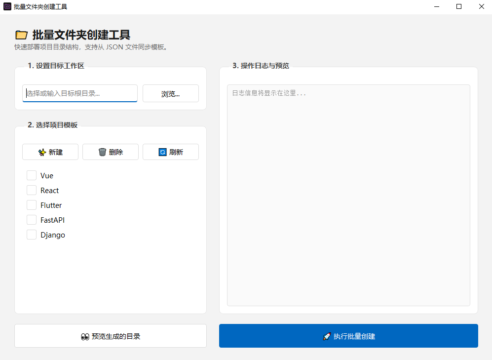

# 📁 批量文件夹创建工具 (PyQt6)

这是一个使用 Python 和 PyQt6 开发的批量文件夹结构生成器，专为开发者设计。它可以根据预设或自定义模板在指定目录下快速创建子目录。





## ✨ 功能特性

- **一键创建**: 勾选模板，点击“执行创建”即可自动生成 nested(嵌套) 目录结构。
- **模板持久化**: 所有模板存储在工程同级的 `templates.json` 文件中，下次启动自动加载。
- **自定义模板**: 支持在 GUI 中直接添加、删除或刷新模板。
- **防止覆盖**: 若目标目录已存在同名文件夹，程序将跳过并记录在日志中，不会报错或删除已有内容。
- **日志反馈**: 实时显示创建过程，支持创建前预览。

## 🚀 运行环境

- **操作系统**: Windows (优先支持)、macOS、Linux
- **Python**: 3.8+
- **依赖库**: PyQt6

## 📦 运行步骤

1. **安装依赖** (如果尚未安装):
   ```bash
   pip install PyQt6
   ```

2. **启动程序**:
   ```bash
   python main.py
   ```

## 🛠 使用说明

1. **选择目录**: 点击“浏览...”按钮选择你想要创建项目结构的根文件夹。
2. **选择模板**: 在列表中勾选你需要的技术栈模板（可多选）。
3. **管理模板**:
   - 点击 **新建模板**: 输入模板名和目录结构（每行一个路径，如 `src/components`）。
   - 点击 **预览结构**: 在日志区查看即将创建的文件夹明细。
4. **执行创建**: 点击绿色的 **执行创建** 按钮。

## 📄 模板示例 (templates.json)

程序启动时会自动读取此文件。你可以直接在 GUI 中修改，也可以手动编辑此文件：

```json
{
  "Vue": ["src/assets", "src/components", "src/views"],
  "Simple-Python": ["app", "tests", "docs"]
}
```

---
*由 Antigravity 强力驱动*
